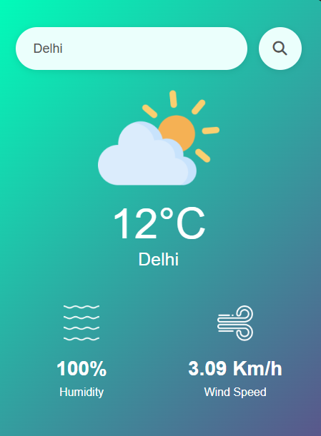

# 🌤️ Weather App

A sleek and responsive web application that provides real-time weather information for cities worldwide.

 <!-- Replace with the actual path to your screenshot -->

## 🌐 Live Demo

Experience the application here: [Weather App](https://gulzaralice1.github.io/Weather-app/)

## ✨ Features

- 🔍 **City Search**: Retrieve current weather data for any city.
- 🌡️ **Temperature Display**: View the current temperature in Celsius.
- 💧 **Humidity Levels**: Check the current humidity percentage.
- 🌬️ **Wind Speed**: Observe the current wind speed in km/h.
- 📱 **Responsive Design**: Optimized for both desktop and mobile devices.

## 🚀 Getting Started

### Prerequisites

Ensure you have a modern web browser installed.

### Installation

1. **Clone the repository**:

   ```bash
   git clone https://github.com/Gulzaralice1/Weather-app.git
